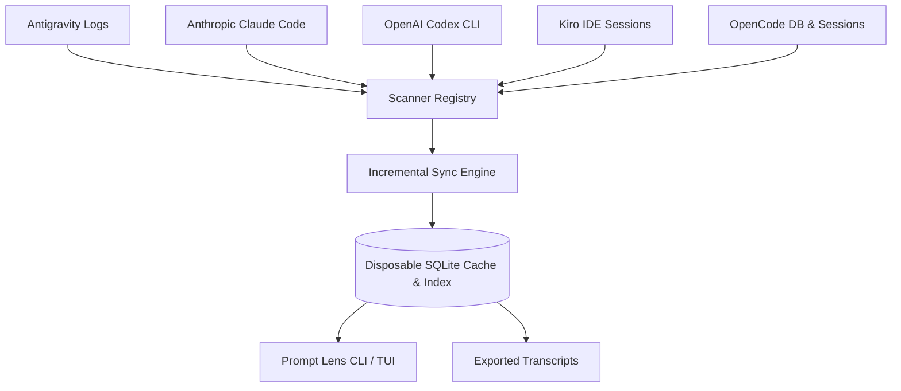

# Production Architecture & Design Blueprint: Prompt Lens (`prompt-lens`)

A local-first developer telemetry and prompt intelligence engine for developers using multiple AI coding assistants (**Antigravity IDE, Anthropic Claude Code, OpenAI Codex, Kiro IDE, OpenCode**).

---

## 1. System Vision & Non-Negotiables

1. **100% Privacy & Local-First**: No developer prompts or sensitive code snippets ever leave the developer machine. All cached content is stored locally in plaintext without cloud telemetry or external logging.
2. **Zero-Config Passive Scanning**: Automatic ingestion from standard OS file paths (`.jsonl`, SQLite, `.json`).
3. **Deep Navigation**: Instant date, project, and scope filtering with one-click Exported Transcript generation for IDE inspection.
4. **Disposable Derived Cache**: Local SQLite database acts strictly as a disposable derived cache and index. Authoritative source sessions remain primary, and deleting a source session reconciles it out of the cache.
5. **Two-Tier Session Loading**: Keeps lightweight Session metadata available for fast navigation while loading complete Turn bodies only on-demand (Cached Content with LRU and age retention limits).

---

## 2. Monorepo Package Structure

```
PromptTracker/
├── packages/
│   ├── core/           # Normalized schemas, pricing catalog, SQLite storage & cache retention, Markdown exporter
│   │   ├── src/
│   │   │   ├── config.ts         # User cache configuration (~/.prompttracker/config.json)
│   │   │   ├── exporter.ts       # Markdown & JSON Exported Transcript generation
│   │   │   ├── legacyMigration.ts # Safe transactional legacy JSON cache migration
│   │   │   ├── pricing.ts        # Embedded offline fallback + 24h background sync
│   │   │   ├── storage.ts        # Disposable SQLite database & LRU/age retention
│   │   │   └── sync.ts           # Incremental multi-source reconciliation
│   │   └── package.json
│   │
│   ├── scanners/       # Pluggable Tool Scanners
│   │   ├── src/
│   │   │   ├── AntigravityScanner.ts
│   │   │   ├── ClaudeCodeScanner.ts
│   │   │   ├── CodexScanner.ts
│   │   │   ├── KiroScanner.ts
│   │   │   └── OpenCodeScanner.ts
│   │   └── package.json
│   │
│   └── cli/            # Standalone prompt-lens CLI & Ink Terminal UI
│       ├── src/
│       │   ├── cli.ts            # CLI commands (scan, stats, list, export, cache)
│       │   ├── dateFilter.ts     # Date preset filtering (Today, 7D, 30D, custom)
│       │   ├── scope.ts          # Project scoping & global toggle
│       │   ├── sessionLoader.ts  # Lazy Turn loading & source rehydration
│       │   └── ui/               # Ink React Terminal UI components
│       └── package.json
│
├── docs/               # Architecture, Specification & ADRs
│   ├── adr/            # ADR 0001 - ADR 0005
│   ├── SPEC.md
│   └── ARCHITECTURE.md
├── CONTEXT.md          # Canonical domain glossary
└── package.json
```

---

## 3. Core Engine Architecture



---

## 4. Key Architectural Guarantees

1. **Incremental Sync & Reconciliation**: Scanners check file modification time and size signals before parsing. When an authoritative source session is removed, reconciliation purges both its metadata and Cached Content.
2. **Bounded Cached Content**: Full Turn bodies are retained in SQLite with configurable retention limits (default 30 days and 250 MB). Least-recently-accessed Turn bodies are evicted when limits are exceeded while metadata remains available for navigation.
3. **No Process-Memory Claims**: Cached Content refers exclusively to Turn bodies retained in SQLite, not total Node.js RAM usage.
4. **Full-Fidelity Exports**: Exporting a session creates a standalone Markdown Exported Transcript with un-truncated prompts and responses for long-term archival before authoritative sources are pruned.
