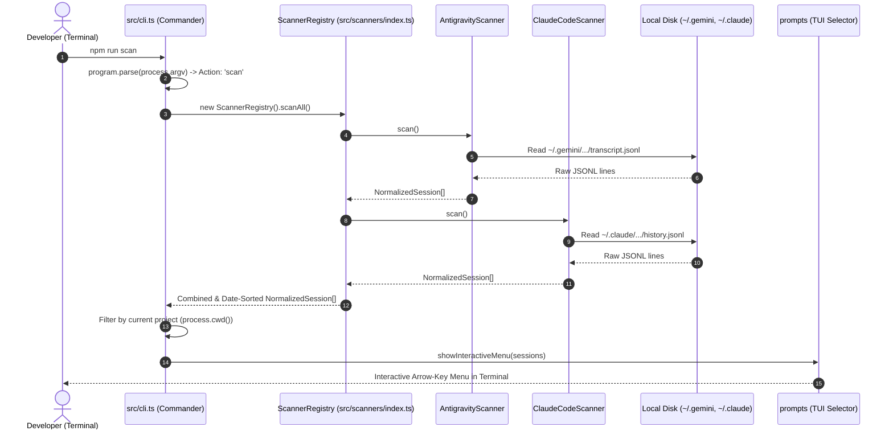
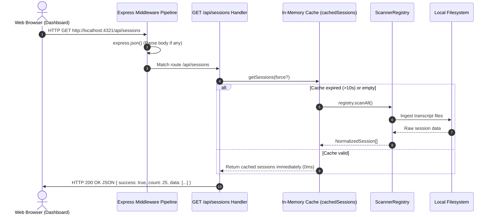

# Engineering Lesson 02: Execution Flow & Request/Response Life Cycle

> **Target Audience**: Engineers coming from **C# / ASP.NET Core** who want to understand how TypeScript/Node.js CLI & Express projects build, initialize, execute, and handle requests compared to the .NET pipeline.

---

## 1. Mental Model: ASP.NET Core vs. Node.js / TypeScript

In **ASP.NET Core**, you are used to:
1. `Program.cs` / `Startup.cs` initializing `WebApplicationBuilder`.
2. Registering Services with Dependency Injection (`builder.Services.AddScoped<...>()`).
3. Configuring the **Middleware Pipeline** (`app.UseRouting()`, `app.UseAuthentication()`, `app.UseEndpoints()`).
4. Compiling via `dotnet build` into IL binaries (`.dll`), executed by the CLR.
5. Inbound HTTP requests hitting Kestrel -> Middlewares -> Controllers (`[HttpGet]`) -> Entity Framework -> SQL Database -> Returning `IActionResult`.

In **Node.js + TypeScript (PromptTracker)**:
| ASP.NET Core Concept | Node.js / TypeScript Equivalent in PromptTracker |
| :--- | :--- |
| `dotnet build` / `bin/Debug/net8.0/*.dll` | `npm run build` (`tsc`) transpiles `.ts` into JavaScript `.js` in `dist/` |
| `Program.Main()` | Entry script executed: `src/cli.ts` (or `dist/cli.js` when built) |
| `builder.Services.AddSingleton<ScannerRegistry>()` | Instantation in code: `new ScannerRegistry()` |
| `app.UseMiddleware<...>()` / `app.UseStaticFiles()` | Express Middleware: `app.use(express.json())`, `app.use(express.static(...))` |
| Controller Action (`[HttpGet("api/sessions")]`) | Express Route Handler: `app.get('/api/sessions', async (req, res) => { ... })` |
| EF Core / SQL Database | **Local File System Ingestion** (reads `transcript.jsonl` files on disk into memory cache) |

---

## 2. Does "Build" Run the Project?

**No.** In TypeScript/Node.js, **build** and **run** are two distinct stages:

```
                  ┌───────────────────────────────┐
                  │          SOURCE CODE          │
                  │   src/*.ts (TypeScript files) │
                  └───────────────┬───────────────┘
                                  │
                                  │  npm run build (tsc)
                                  ▼
                  ┌───────────────────────────────┐
                  │       COMPILED OUTPUT         │
                  │     dist/*.js (JavaScript)    │
                  └───────────────┬───────────────┘
                                  │
                                  │  node dist/cli.js (or npm start)
                                  ▼
                  ┌───────────────────────────────┐
                  │      RUNNING PROCESS          │
                  │       (V8 Engine)             │
                  └───────────────────────────────┘
```

- **`npm run build` (`tsc`)**: The TypeScript compiler checks types and transpiles files from `src/` to plain JavaScript in `dist/`. It does **not** start the app.
- **`npm run start` (`node dist/cli.js`)**: Executes the compiled JavaScript.
- **`npm run dev` / `npm run scan` (`ts-node src/cli.ts`)**: `ts-node` is a development helper that compiles TypeScript in-memory on the fly and immediately executes it (similar to `dotnet watch run`).

---

## 3. What Class/File is Invoked First?

When you run `npm run scan` or `npm run ui`, the entry point is **[`src/cli.ts`](file:///d:/PetProjects/PromptTracker/prototype/src/cli.ts)**.

### Step-by-Step Flow for the CLI (`npm run scan`)



1. **`src/cli.ts` executes top-level code**:
   `const program = new Command();` initializes the CLI definitions.
2. **`commander` parses arguments**:
   Determines whether the user called `scan` or `ui`.
3. **If `scan` is invoked**:
   - `const registry = new ScannerRegistry()` is instantiated.
   - `registry.scanAll()` loops through all registered scanner classes (`AntigravityScanner`, `ClaudeCodeScanner`, `CodexScanner`, `KiroScanner`, `OpenCodeScanner`).
   - Each scanner reads its specific directory on disk, parses raw lines, calculates tokens via `approximateTokens()`, and returns `NormalizedSession[]`.
   - Results are sorted by timestamp descending.
   - `cli.ts` filters the sessions to match your current working directory (`process.cwd()`).
   - `showInteractiveMenu()` invokes `prompts()` which draws the interactive menu in the terminal.

---

## 4. The Web Server Request/Response Pipeline (`npm run ui`)

When you run `npm run ui`, `src/cli.ts` calls `createServer()` from **[`src/server/index.ts`](file:///d:/PetProjects/PromptTracker/prototype/src/server/index.ts)** and starts an Express HTTP server on port `4321`.

### The Middleware Pipeline in Express
Just like `app.Use(...)` in ASP.NET Core:

```typescript
export function createServer() {
  const app = express();
  const registry = new ScannerRegistry();

  // 1. Body Parser Middleware (similar to ASP.NET Core JSON model binder)
  app.use(express.json());

  // 2. Static Files Middleware (similar to app.UseStaticFiles() in ASP.NET Core)
  app.use(express.static(path.join(__dirname, '..', '..', 'public')));
  ...
```

### Complete Request / Response Lifecycle for `GET /api/sessions`



### Route Handler Breakdown:
1. **Inbound HTTP Request**: Browser makes `fetch('/api/sessions')`.
2. **Middleware Pipeline**:
   - `express.static`: Checks if a matching static file exists in `public/`. If not, passes to next.
   - `express.json()`: Parses any incoming JSON payload.
3. **Route Match**: Matches `app.get('/api/sessions', async (req, res) => { ... })`.
4. **Data Layer (`getSessions`)**:
   - Implements a **10-second in-memory cache** to prevent reading thousands of disk files on every browser click.
   - If cache is stale: calls `registry.scanAll()` to re-ingest local disk logs.
5. **Response Return (`res.json`)**:
   - Formats a standard JSON response (`{ success: true, count: X, data: [...] }`) and sets `Content-Type: application/json`.

---

## 5. The "Open Session in IDE" POST Pipeline (`POST /api/open-session`)

When you click **"Open in IDE"** on the Web UI or CLI:

```typescript
app.post('/api/open-session', async (req, res) => {
  const { sessionId } = req.body;        // 1. Model Binding from JSON
  const sessions = await getSessions();  // 2. Lookup session
  const session = sessions.find(s => s.id === sessionId);

  if (session) {
    // 3. Export to formatted Markdown file in ~/.prompttracker/exports/
    const mdFilePath = exportSessionToMarkdown(session);

    // 4. OS Process Execution: Launch system editor (VS Code / default)
    const cmd = process.platform === 'win32' ? `start "" "${mdFilePath}"` : `open "${mdFilePath}"`;
    exec(cmd, (err) => {
      if (err) exec(`code "${mdFilePath}"`);
    });

    // 5. Return success JSON
    return res.json({ success: true, mdFilePath });
  }

  res.status(404).json({ success: false, error: 'Session not found' });
});
```

---

## 6. Summary Comparison Cheatsheet

| Task | ASP.NET Core Pattern | PromptTracker Pattern |
| :--- | :--- | :--- |
| **Compilation** | `dotnet build` | `npm run build` |
| **Live Dev Run** | `dotnet watch run` | `npm run dev` or `npm run scan` |
| **Entry Point** | `Program.cs` -> `Main()` | `prototype/src/cli.ts` |
| **DI / Registration** | `IServiceCollection` / `AddScoped` | `ScannerRegistry` class managing scanners |
| **Middlewares** | `app.Use(...)` | `app.use(express.static(...))` |
| **HTTP Routing** | `[Route("api/[controller]")]` | `app.get(...)`, `app.post(...)` |
| **Serialization** | `System.Text.Json` | `JSON.parse()` / `res.json()` |
| **Data Storage** | SQL Server / PostgreSQL (EF Core) | Local `.jsonl` telemetry logs + In-memory cache |
