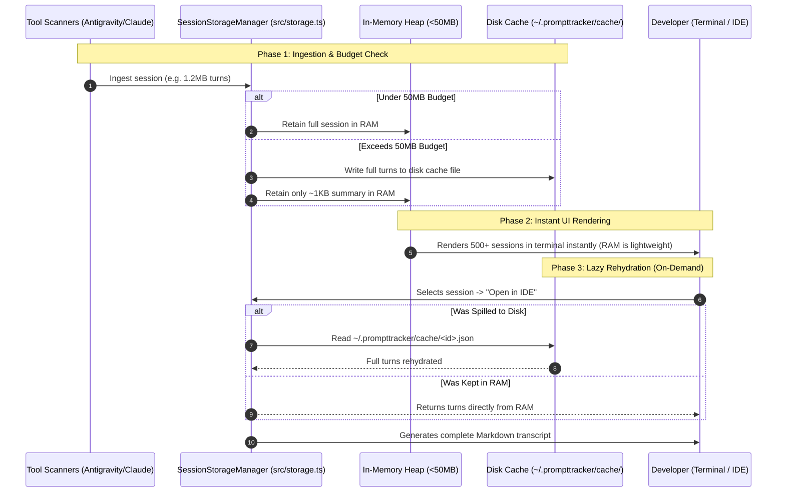

# Engineering Lesson 05: Memory Management, Thresholds & Disk Spillover

> **Target Audience**: Engineers asking: *What is the 50MB RAM limit doing? Why do we track memory? How does disk spillover work in high-throughput local applications?*

---

## 1. Why Do We Care About RAM in a Local CLI Tool?

When you run `npm start`, PromptTracker scans **all** AI coding logs on your machine (`~/.gemini`, `~/.claude`, etc.).

### The Problem:
- A developer who codes with AI assistants every day generates **10 to 50 conversations per week**.
- Over a year, that is **2,000+ sessions**.
- Each AI conversation transcript contains full source code files, multi-file diffs, and tool execution logs. A single session can be **500KB to 2MB** of text.
- If we hold all 2,000 sessions in RAM at once:
  $$2,000 \text{ sessions} \times 1 \text{ MB} \approx 2 \text{ Gigabytes of RAM}$$
- Loading 2GB into the Node.js V8 process would cause:
  1. High memory spikes on your machine.
  2. Severe V8 Garbage Collection (GC) pauses (making the CLI freeze).
  3. Possible `FATAL ERROR: Ineffective mark-compacts near heap limit Allocation failed - JavaScript heap out of memory`.

---

## 2. What Does the 50MB Limit Do?

In **[`src/storage.ts`](file:///d:/PetProjects/PromptTracker/prototype/src/storage.ts)**, we built a **Dynamic Spillover Engine** (`SessionStorageManager`):

```typescript
const storageManager = new SessionStorageManager(50); // 50MB Ceiling
```

Instead of allowing memory to grow unbounded, we enforce a **strict 50MB budget** for session content:

```
                                  [ Scanned Sessions ]
                                           │
                                           ▼
                       [ SessionStorageManager.manageSessionMemory() ]
                                           │
                        Is (currentRAM + sessionSize) <= 50MB?
                                           │
                        ┌──────────────────┴──────────────────┐
                        │                                     │
                     [ YES ]                                [ NO ]
                        ▼                                     ▼
             Keep 100% in RAM               [ 💽 SPILL TO DISK CACHE ]
       (Prompts, full responses, diffs)     1. Write full turns JSON to:
                                               ~/.prompttracker/cache/<sessionId>.json
                                            2. Keep only lightweight summary in RAM:
                                               - userPrompt (first 300 chars)
                                               - assistantSummary (300 chars)
                                               - token numbers and cost metadata
                                            3. Mark sessionId in spilledSessionIds set
```

---

## 3. The 3 Phases of Session Memory Lifecycle



---

## 4. Code Breakdown: How Memory is Estimated & Spilled

### 1. Byte Estimation (`estimateTurnsSize`)
In JavaScript, characters are stored in UTF-16 (2 bytes per character):
```typescript
private estimateTurnsSize(turns: PromptTurn[]): number {
  let size = 0;
  for (const t of turns) {
    size += (t.userPrompt?.length || 0) * 2;
    size += (t.assistantResponse?.length || 0) * 2;
    size += (t.assistantSummary?.length || 0) * 2;
    if (t.toolCalls) {
      size += JSON.stringify(t.toolCalls).length * 2;
    }
    size += 200; // object overhead
  }
  return size;
}
```

### 2. Trimming RAM (`manageSessionMemory`)
When the 50MB limit is reached, we convert the heavy session into a lightweight skeleton:
```typescript
// Replaces heavy multiline code blocks with 300-char preview in RAM
session.turns = session.turns.map(t => ({
  turnIndex: t.turnIndex,
  timestamp: t.timestamp,
  userPrompt: t.userPrompt.slice(0, 300),
  assistantSummary: t.assistantSummary || t.assistantResponse?.slice(0, 300),
  tokens: t.tokens
}));
```

### 3. Transparent Lazy Rehydration (`loadFullTurns`)
When you click into a session or export it to Markdown, the system checks if it was spilled and reads the complete payload back from disk:
```typescript
public loadFullTurns(session: NormalizedSession): PromptTurn[] {
  if (this.spilledSessionIds.has(session.id)) {
    const cachePath = path.join(this.cacheDir, `${session.id}.json`);
    if (fs.existsSync(cachePath)) {
      return JSON.parse(fs.readFileSync(cachePath, 'utf8'));
    }
  }
  return session.turns;
}
```

---

## 5. What the Terminal Output Means

In your terminal, you saw:
```text
USAGE SUMMARY:  Prompts: 473 | Tokens: 2,522,313 | Cost: $1.4596 | Memory: 8.18/50MB (0 spilled)
```

- **`Memory: 8.18/50MB`**: All 473 sessions currently consume **8.18 Megabytes** of text data in memory.
- **`50MB`**: The safe memory ceiling.
- **`0 spilled`**: Since 8.18MB is less than 50MB, all 473 sessions fit comfortably in RAM without needing to spill to disk.
- If you had 3,000 sessions (e.g. 80MB), the display would show:
  `Memory: 49.80/50MB (850 spilled)`
  and those 850 older sessions would be cached safely on disk without slowing down your computer.
