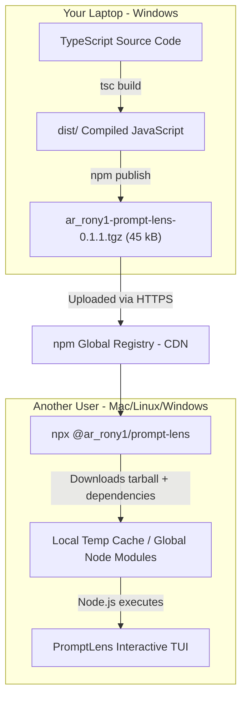
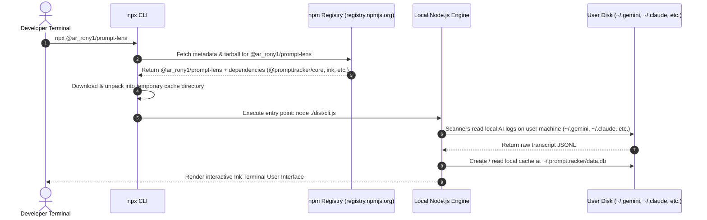

# 🎓 How npm & CLI Packaging Work: From Local Code to Global Execution

Have you ever wondered: **"I only wrote code on my laptop. How can another developer on Linux, macOS, or Windows run `npx @ar_rony1/prompt-lens` and have my application run without downloading my project repository?"**

This lesson covers the complete architecture of npm packages, binaries, compilation, and cross-platform execution.

---

## 1. The Big Picture: What Actually Happened When You Ran `npm publish`?

When you ran `npm publish`, your computer didn't upload a Git repository. It created a compressed archive called a **Tarball (`.tgz`)** containing only your compiled JavaScript, assets, and `package.json`.



---

## 2. Why Doesn't the User Need TypeScript or Source Files?

1. **Compilation Step**:
   - In development, you write in **TypeScript** (`.ts`, `.tsx`), which Node.js cannot run natively.
   - When you run `npm run build`, the TypeScript compiler (`tsc`) transforms your code into standard, universal **JavaScript (`dist/*.js`)**.
2. **Clean Tarball**:
   - The `.tgz` package sent to npm contains `dist/cli.js`.
   - Node.js on the user's machine directly executes standard JavaScript via the V8 engine — no TypeScript compiler needed!

---

## 3. How Does the Terminal Know What `prompt-lens` Means? (The `bin` Secret)

In your [`packages/cli/package.json`](file:///d:/PetProjects/PromptTracker/packages/cli/package.json), you defined:

```json
{
  "name": "@ar_rony1/prompt-lens",
  "bin": {
    "prompt-lens": "./dist/cli.js",
    "promptlens": "./dist/cli.js",
    "prompttracker": "./dist/cli.js"
  }
}
```

And in the very first line of [`packages/cli/src/cli.ts`](file:///d:/PetProjects/PromptTracker/packages/cli/src/cli.ts):
```javascript
#!/usr/bin/env node
```

### The Magic of the Shebang (`#!/usr/bin/env node`):
1. **On macOS / Linux**: The OS reads the first line of the file (`#!/usr/bin/env node`). It knows to invoke the system's `node` interpreter to execute the script.
2. **On Windows**: npm creates a shim script (`prompt-lens.cmd` and `prompt-lens.ps1`) in the user's PATH that launches `node.exe "path\to\dist\cli.js" %*`.
3. **When installed globally** (`npm install -g`): npm creates a symlink in the system's PATH pointing to your entry point.

---

## 4. What Happens Step-by-Step When a User Runs `npx @ar_rony1/prompt-lens`?

`npx` (Node Package eXecute) allows running CLI packages without permanent installation.



### Step Breakdown:
1. **Lookup**: `npx` contacts `https://registry.npmjs.org/@ar_rony1/prompt-lens` to fetch the latest version manifest.
2. **Dependency Resolution**: It resolves dependencies declared in `package.json` (`@prompttracker/core`, `@prompttracker/scanners`, `ink`, `better-sqlite3`, `chalk`, etc.).
3. **Download to Temp Directory**: It downloads all `.tgz` archives into the user's temporary npx cache (`%LocalAppData%\npm-cache\_npx` on Windows or `~/.npm/_npx` on macOS/Linux).
4. **Execution**: It launches `dist/cli.js`.
5. **Local Telemetry Discovery**: Your `AntigravityScanner`, `ClaudeCodeScanner`, and `CodexScanner` run locally on *that user's machine*, looking for `~/.gemini/antigravity-ide/brain` or `~/.claude/projects`.
6. **SQLite Storage**: PromptLens creates `~/.prompttracker/data.db` on *their* home directory.

---

## 5. How Do Cross-Tool Scanners Work on Other Machines?

Because PromptLens uses Node.js standard libraries:
- `os.homedir()` resolves to `/Users/alice` on macOS, `/home/bob` on Linux, and `C:\Users\Charlie` on Windows.
- Paths are normalized across operating systems using forward slashes.
- If the user uses **Antigravity**, `AntigravityScanner` finds their local `~/.gemini/antigravity-ide/brain` folder.
- If the user uses **Claude Code**, `ClaudeCodeScanner` finds their local `~/.claude/projects` folder.
- Everything runs **100% offline and locally** with zero network communication (except the background OpenRouter pricing sync).

---

## 6. Summary Comparison: `git clone` vs `npm publish`

| Dimension | Git Repository (`git clone`) | npm Package (`npx` / `npm install`) |
| :--- | :--- | :--- |
| **Audience** | Contributors / Developers who edit source code | End users / Developers who want to run the tool |
| **Payload** | TypeScript source files, tests, git history, docs | Compiled JS bundle, executable entry points, runtime dependencies |
| **Requirements** | Node.js, npm, TypeScript, `git`, build tools | Only Node.js |
| **Setup time** | Minutes (`clone` ➔ `npm install` ➔ `npm run build`) | **Zero seconds (`npx @ar_rony1/prompt-lens`)** |

---

## 7. Key Takeaways

1. **npm is a global package registry & CDN** for compiled software artifacts.
2. **`package.json` is the manifest** that tells npm what the package is named, what dependencies it requires, and what executable binary commands it provides (`bin`).
3. **`npx` is an ephemeral runner** that downloads, caches, executes, and updates packages seamlessly without polluting global environments.
4. **Local code becomes global** because your compiled JavaScript code is self-contained and communicates with the host operating system through standard Node.js APIs!
